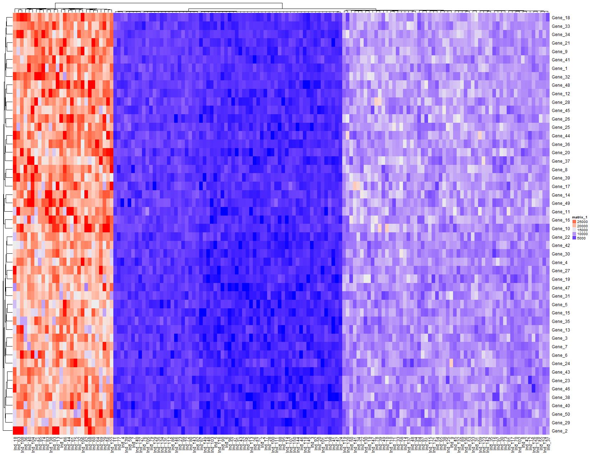
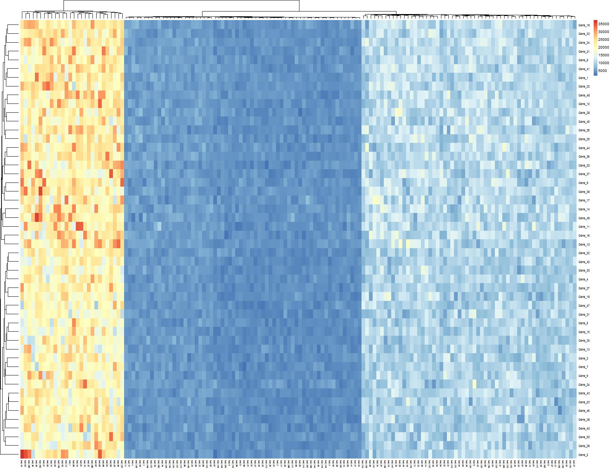

# Introduction

This repository maintains a list of different heatmap options in R, including fully vetted packages in CRAN / Bioconductor as well as emerging packages with devtools.

# Info
The main information is stored in the [r_heatmap_packages.tsv](http://www.robersonlab.org/drop_it_like_its_hot_r/r_heatmap_packages.tsv) file.

* Package - name of the package.
* Function - name of the function to plot a heatmap
* Distribution - where you can get it (base, CRAN, BioC, or devtools)
* Input - list of acceptable input
* MatrixMinInput - will it accept a matrix only as input
* SimpleFigureOut - is output a figure or interactive?
* Repository - link to development repository for the package
* Maintainer_Name - name from the package information
* Maintainer_Email - email from package information
* Twitter - handle if account known
* Status - special notes, such as in development or deprecated

Included here is a **basic** list of packages. If the input takes a single matrix and makes simple output, the package should have a demonstration output. *All of them are created from the same input!*

# Simple package list

## Accepts single matrix, image output

| Package | Function | Image |
| ------- | -------- | ----- |
| [ComplexHeatmap](https://github.com/jokergoo/ComplexHeatmap) | Heatmap | | |
| [d3heatmap](https://github.com/rstudio/d3heatmap) | d3heatmap |  |
| [gplots](https://github.com/cran/gplots) | heatmap.2 |  |
| heatmap.plus | heatmap.plus |  |
| heatmap3 | heatmap3 |  |
| [heatmaply](https://github.com/talgalili/heatmaply) | heatmaply |  |
| [Heatplus](https://github.com/alexploner/Heatplus) | annHeatmap2 |  |
| [iheatmapr](https://github.com/AliciaSchep/iheatmapr) | main_heatmap |  |
| NeatMap | heatmap1 |  |
| [NMF](http://github.com/renozao/NMF) | aheatmap |  |
| [pheatmap](https://github.com/cran/pheatmap) | pheatmap |  |
| [qtlcharts](https://github.com/kbroman/qtlcharts) | iheatmap |  |
| [stats](https://svn.r-project.org/R) | heatmap |  |
| [superheat](https://github.com/rlbarter/superheat) | superheat |  |
| [vcfR](https://github.com/knausb/vcfR) | heatmap.bp |  |

## Accepts single matrix, interactive output

| [d3heatmap](https://github.com/rstudio/d3heatmap) | d3heatmap   |   |
| [heatmaply](https://github.com/talgalili/heatmaply) | heatmaply   |   |
| [Heatplus](https://github.com/alexploner/Heatplus) | annHeatmap2   |   |
| [iheatmapr](https://github.com/AliciaSchep/iheatmapr) | main_heatmap   |   |
| [qtlcharts](https://github.com/kbroman/qtlcharts) | iheatmap   |   |

## Multiple matrix input / other requirements

| [EnrichedHeatmap](https://github.com/jokergoo/EnrichedHeatmap) | EnrichedHeatmap   |   |
| gapmap | gapmap   |   |
| [ggplot2](https://github.com/tidyverse/ggplot2) | geom_tile   |   |
| mcheatmaps | mcheatmaps   |   |
| pairheatmap | pairheatmap   |   |

